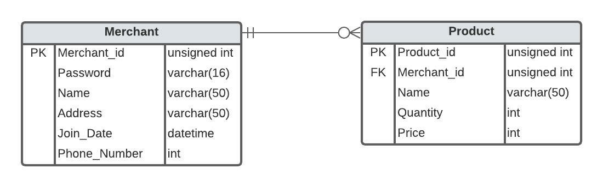

# Hello!
A Simple Mini Project using Express JS & MySQL to create Merchant Service API.

---
## Requirements
For development, you will only need Node.js and NPM, installed in your environment.

## Install
    $ git clone https://github.com/raihanromzi/merchant-services
    $ cd merchant-services
    $ npm install

## Running the project
    $ npm start

## Project Info
### Architecture Diagram

### ERD

### API Documentation
[Open API](https://app.swaggerhub.com/apis/raihanromzi/Merchant-Service/1)